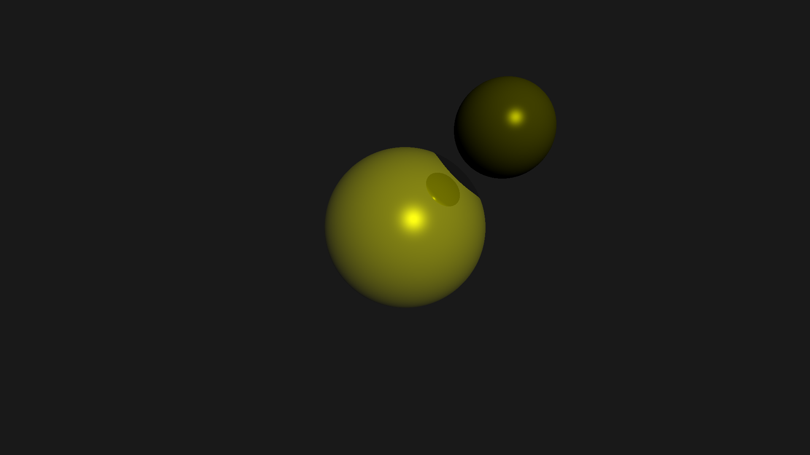

# Raytracer
Simple raytracer, written in c, which can generate randomized scenes of spheres and directional lights.




## Building
You only need a c compiler and a unix environment to build the project.

To build: `make`

## Running
```
usage: raytracer [OPTIONS]

DESCRIPTION
A simple raytracer for spheres. Modify the struct inside scene.c
to edit the scene. Use the below options to randomize a scene.
Output is a ppm file writen to stdout.

OPTIONS
 -o  --  Randomize the objects within the scene
 -l  --  Randomize the lighting within the scene
 -h  --  Print this help message
 ```
